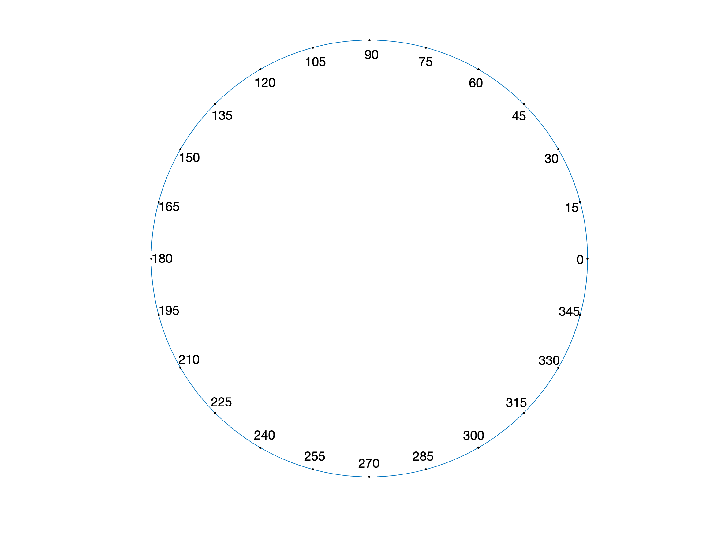

# MATLAB Label points along a curve with nice offset

Using MATLAB's `text` to label points along a parametric curve often
results in the label blocking the curve.  This can be avoided for simple
curves by using the text alignment properties or by offsetting the points.
However, these techniques do not work for curves that change direction.

This tool, `ptlabel_along`, interpolates the provided curve to place
points at just the desired parameter values.  It also computes the local
slope of the line and uses that to offset the text perpendicular to the
line.  This makes labeling parameter values along curves easy and
beautiful.

## Example Use

    th = linspace( 0, 360, 181 );
    thmark = 0:15:359;
    x = cos( th * pi / 180 );
    y = sin( th * pi / 180 );
    plot( x, y );
    axis equal
    axis off

    ptlabel_along( x, y, th, thmark );

## Documentation

[HL, HT] = PTLABEL_ALONG( XC, YC, TC, T ) plots and labels points at
parameter T along a parametric curve (XC, YC, TC).  The text labels are
nicely offset from the curve.

[HL, HT] = PTLABEL_ALONG( XC, YC, TC, T, DST ) as above, but with the
label offset distance fraction specified in DST (0.02).  The offset
distance is specified as a fraction of the X-Axis length.  A Positive
DST will place the labels on the left side of the curve, negative DST
to the right.

[HL, HT] = PTLABEL_ALONG( XC, YC, TC, T, DST, LINESPEC ) as above, but
will plot the desired parametric points with line specifier string
LINESPEC ('k.').

The line or point plot handle is returned in HL.  The text label handle
is returned in HT.

If the data or plot aspect ratios change significantly after the call
to PTLABEL_ALONG, the text labels may not look properly offset.

## License

This software is Copyright (c) Rob McDonald 2021 and is released under the
terms specified in the [license](license.txt).
